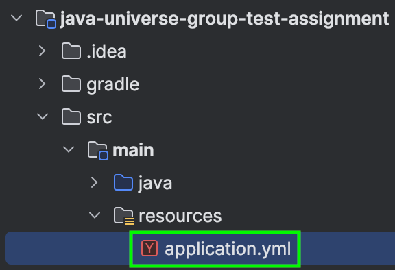
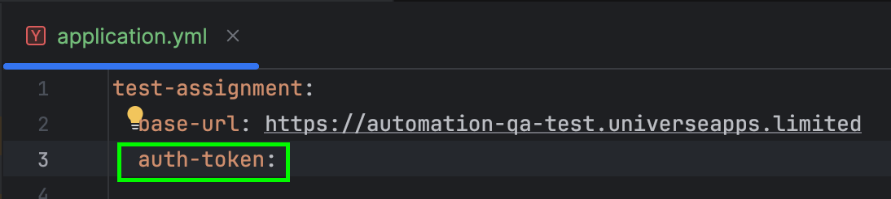
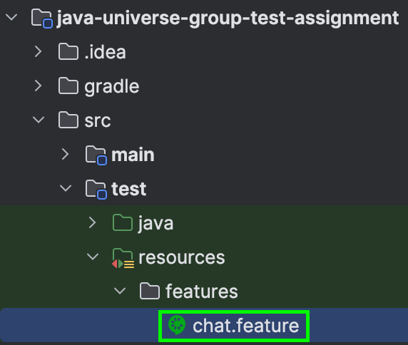
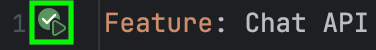
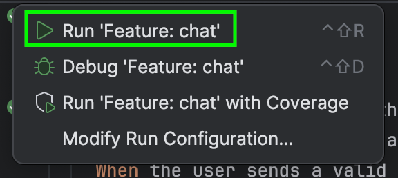
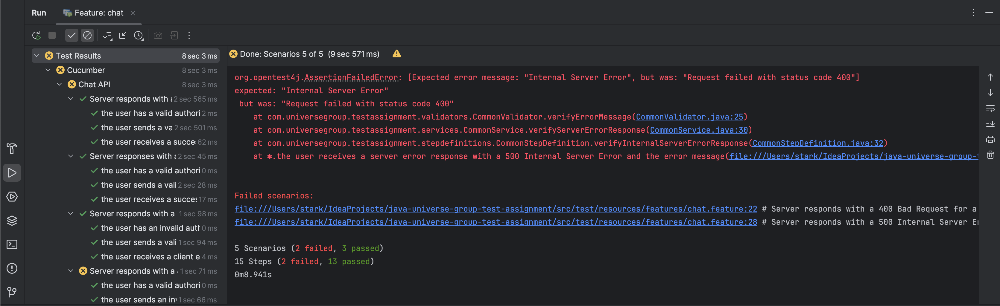

# Java Universe Group Test Assignment

## Description
The project is a Test Automation framework capable of executing BE tests written in BDD style. 
It supports test execution via IntelliJ IDEA, Gradle task, or Docker container.

## Prerequisites
- Java 21+
- Cucumber for Java plugin for Intellij IDEA
- Docker

## Setup
### Option 1. Run via IntelliJ IDEA UI
1. Open __IntelliJ IDEA__ setting.
2. Navigate to the __Plugins__ section.
3. Search for official __Cucumber for Java__ Jetbrains plugin and install it.
4. Open the `application.yml` located in `src/main/resources`:



5. In the `test-assignment.auth-token` property, specify a valid authentication token:



6. Open a __feature file__ located in `src/test/resources/features`:



7. Click on the __green play icon__ at the top near the Feature keyword:



8. Click on __Run__ option:



9. View the test results in the UI at the bottom:




## Option 2. Run via Gradle Task
1. Run the Gradle test task:
```
./gradlew clean test -Dauth-token=<auth_token>
```
Replace `<auth_token>` with a valid authentication token.
2. View the results in the HTML report:
```shell
open build/test-reports/cucumber-report.html
```


## Option 3. Run via Docker Container
1. Build the Docker image:
```shell
docker build -t java-universe-group-test-assignment .
```
2. Run the Docker container:
```
docker run --rm -e AUTH_TOKEN=<auth_token> -v $(pwd)/build/test-reports:/app/build/test-reports java-universe-group-test-assignment
```
Replace `<auth_token>` with a valid authentication token.
3. View the results in the HTML report:
```shell
open build/test-reports/cucumber-report.html
```
